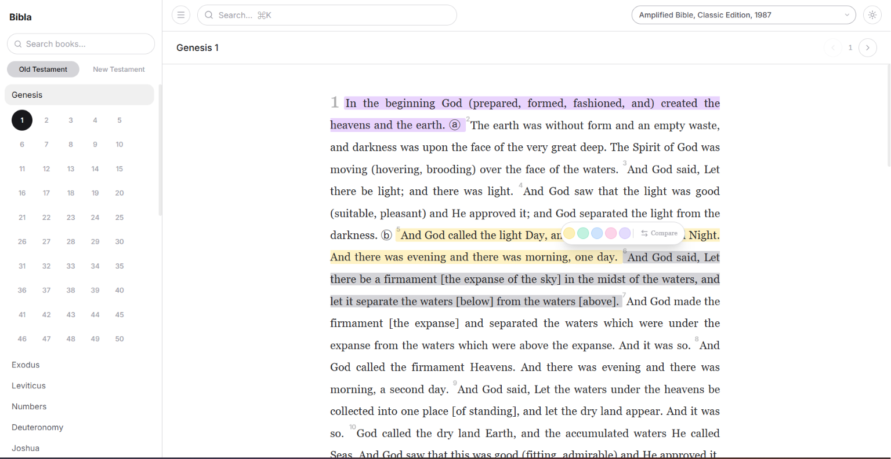

# Bibla - A Beautiful Bible Reader

<p align="center">
  
</p>

A modern Bible reader desktop application built with Wails v3, featuring a dark immersive UI for studying Scripture.

## Features

- **Multiple Translations** - Read from various Bible translations including KJV+, NLT, TLB, TPT, AMPC, and DBYe
- **Full-Text Search** - Search across all verses to find specific passages
- **Bookmarks** - Save verses with custom notes for quick reference
- **Highlights** - Color-code important verses with customizable highlight colors
- **Bible Dictionary** - Look up words and topics with built-in dictionary definitions
- **Dark UI** - Immersive dark theme designed for comfortable reading sessions

## Tech Stack

- **Backend:** Go with Wails v3
- **Frontend:** React + TypeScript + Tailwind CSS
- **Database:** SQLite
- **Build Tool:** Task

## Getting Started

### Prerequisites

- Go 1.25+
- Node.js and pnpm
- [Wails v3 CLI](https://wails.io/)

### Development

```bash
# Install dependencies
cd frontend && pnpm install
cd ..

# Run in dev mode
task dev
```

### Build

```bash
task build
```

## Adding Translations

Place `.SQLite3` Bible translation files in the `bibles/` directory. The app will automatically detect and list them. Each database should contain:

- `books` table with book metadata
- `verses` table with verse text
- `info` table with translation description

## Data Storage

Bookmarks and highlights are stored in `~/.bibla/bookmarks.db`.
